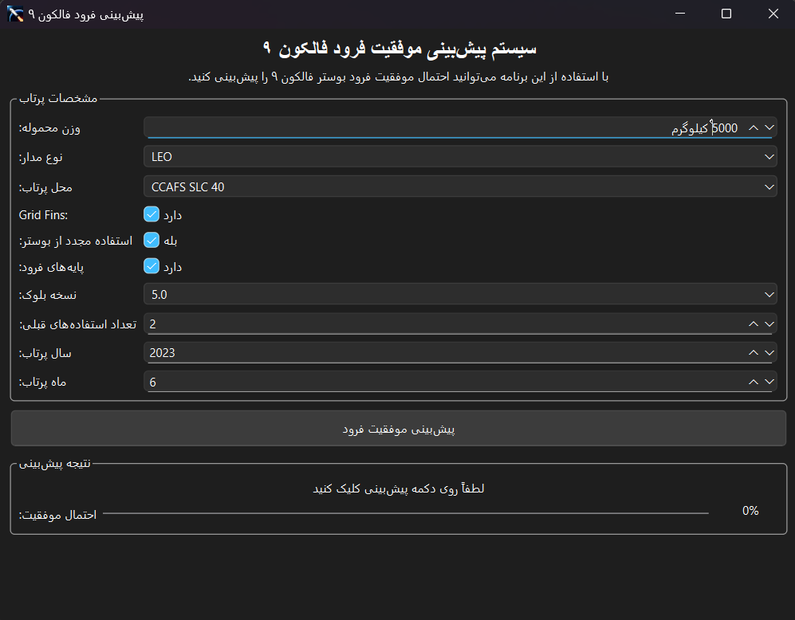

# پیش‌بینی‌کننده فرود فالکون ۹
## این پروژه کاملا با هوش مصنوعی Cursor ai ساخته شده
این پروژه یک اپلیکیشن ویندوزی با معماری شی‌گرا (OOP) و با استفاده از یادگیری ماشین ارائه می‌دهد که می‌تواند احتمال موفقیت فرود بوستر راکت فالکون ۹ شرکت اسپیس‌ایکس را پیش‌بینی کند.



## ویژگی‌ها

- طراحی شی‌گرا با کلاس‌های مجزا برای مدیریت بخش‌های مختلف برنامه
- رابط کاربری گرافیکی مدرن و کاربرپسند با PySide6
- پیش‌بینی موفقیت فرود براساس مشخصات پرتاب
- نمایش احتمال موفقیت به صورت درصد با افکت‌های انیمیشن
- مدیریت منابع هوشمند برای اجرا به عنوان فایل اجرایی مستقل

## معماری برنامه

این برنامه با معماری شی‌گرا (OOP) طراحی شده و شامل کلاس‌های زیر است:

- **ResourceManager**: مدیریت دسترسی به فایل‌های منابع در حالت اجرایی و توسعه
- **PredictionModel**: مدیریت بارگذاری و استفاده از مدل یادگیری ماشین
- **InputForm**: مدیریت فرم ورودی و دریافت پارامترها از کاربر
- **ResultsDisplay**: نمایش نتایج پیش‌بینی به کاربر
- **Falcon9PredictorApp**: کلاس اصلی برنامه که سایر کلاس‌ها را هماهنگ می‌کند

## ساختار پروژه

```
falcon9_project/
├── assets/              # فایل‌های گرافیکی و آیکون‌ها
├── data/                # داده‌های خام
│   └── data_falcon9.csv # داده‌های اصلی فالکون ۹
├── models/              # مدل‌های ذخیره شده
├── src/                 # کدهای منبع
│   ├── __init__.py
│   ├── __main__.py
│   ├── falcon9_app.py   # برنامه اصلی با معماری شی‌گرا
│   ├── save_model.py    # اسکریپت آموزش و ذخیره مدل
│   └── setup.py         # اسکریپت ساخت فایل اجرایی
├── falcon9_analysis.ipynb # نوتبوک تحلیل داده‌ها
├── README.md            # راهنمای پروژه
└── requirements.txt     # لیست کتابخانه‌های مورد نیاز
```

## نصب و راه‌اندازی

### پیش‌نیازها

برای استفاده از این پروژه باید پایتون 3.6 به بالا و کتابخانه‌های زیر را نصب کنید:

```
PySide6
pandas
numpy
scikit-learn
matplotlib (برای نوتبوک)
seaborn (برای نوتبوک)
pyinstaller (برای ساخت فایل exe)
pytest (برای تست‌ها)
```

می‌توانید با استفاده از دستور زیر همه کتابخانه‌های مورد نیاز را نصب کنید:

```
pip install -r requirements.txt
```

### مراحل راه‌اندازی

1. ابتدا مدل را آموزش دهید و ذخیره کنید:

```
python src/save_model.py
```

2. سپس اپلیکیشن را اجرا کنید:

```
python src
```

یا

```
python src/falcon9_app.py
```

### ساخت فایل اجرایی

برای ساخت فایل exe با استفاده از PyInstaller می‌توانید از دستور زیر استفاده کنید:

```
python src/setup.py
```

فایل اجرایی در پوشه dist ساخته می‌شود.

## نحوه استفاده

1. پارامترهای مربوط به پرتاب را در فرم ورودی تنظیم کنید:
   - وزن محموله (کیلوگرم)
   - نوع مدار
   - محل پرتاب
   - Grid Fins (آیا راکت مجهز به بالک‌های کنترلی است؟)
   - استفاده مجدد (آیا بوستر قبلاً استفاده شده است؟)
   - پایه‌های فرود (آیا راکت مجهز به پایه‌های فرود است؟)
   - نسخه بلوک
   - تعداد استفاده‌های قبلی
   - سال و ماه پرتاب

2. روی دکمه "پیش‌بینی موفقیت فرود" کلیک کنید.

3. نتیجه پیش‌بینی و احتمال موفقیت را در بخش نمایش نتایج مشاهده کنید.

## مستندات فنی

این برنامه از یک مدل جنگل تصادفی (Random Forest) استفاده می‌کند که با استفاده از داده‌های پرتاب‌های گذشته راکت‌های فالکون ۹ آموزش دیده است. مدل با دقت حدود 85% می‌تواند موفقیت یا عدم موفقیت فرود بوستر را پیش‌بینی کند.

رابط کاربری با استفاده از PySide6 پیاده‌سازی شده است که یک پیاده‌سازی رسمی از Qt برای پایتون می‌باشد.

### مزایای طراحی شی‌گرا

- **قابلیت نگهداری**: هر کلاس مسئولیت مشخصی دارد که باعث راحتی نگهداری کد می‌شود.
- **قابلیت گسترش**: افزودن ویژگی‌های جدید به برنامه آسان‌تر است.
- **قابلیت آزمون**: تست کردن هر بخش به صورت مستقل امکان‌پذیر است.
- **خوانایی بیشتر**: ساختار کد با تقسیم‌بندی منطقی، خواناتر است.

## مشارکت

برای مشارکت در این پروژه، لطفاً یک Pull Request ایجاد کنید یا برای گزارش مشکلات، یک Issue باز کنید. 